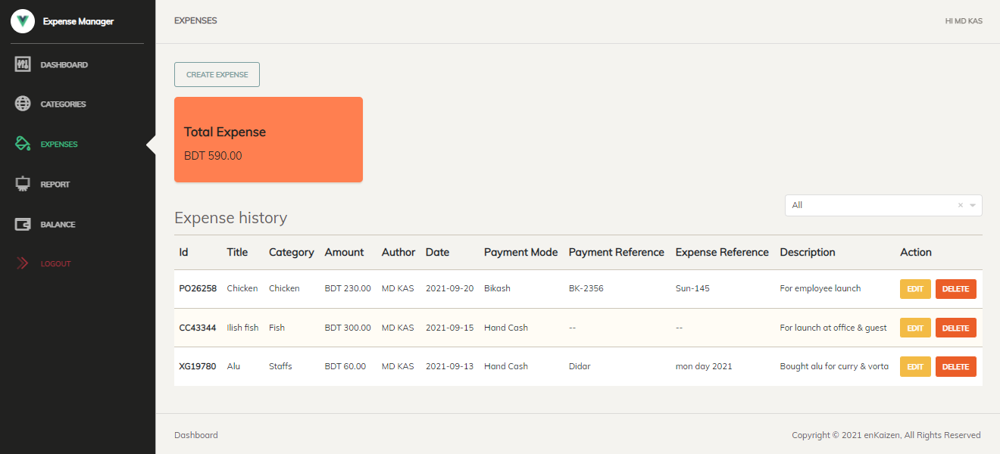

# Expense Manager
An expense manager web application build for managing expenses for a company or organization

## Technologies used to build the application
1. Asp.Net Core 
2. Sql server 2019
3. vuejs 2

<details><summary><b>Instructions to install</b></summary>

1. Install 
	
	```sh
	node.js (LTS)
	sdk: .net 5
	MS SQL Server 2017 or above
	```

2. Go to **ExpenseManager.ClientApplication** :

    ```sh
    $ yarn
	$ yarn watch
    ```

3. Change connection string in **ExpenseManager.Web/appsettings.json**
	
4. Go to **ExpenseManager.Web** :
	
	```sh
	$ dotnet run
	```
</details>

## Screen shoots

1. Dashboard:
	<p align="center">
	  
	</p>

2. Categories:
	<p align="center">
	  
	</p>
3. Expenses:
	<p align="center">
	  
	</p>
4. Balances:
	<p align="center">
	  
	</p>
5. Reports:
	<p align="center">
	  
	</p>
